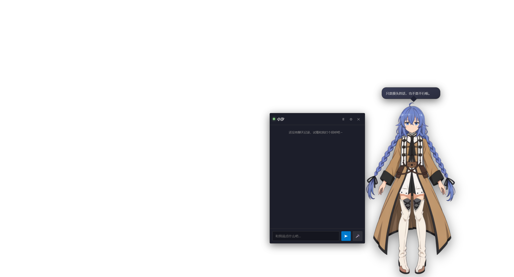

# Live2D 桌面宠物

一个跑在 Windows 桌面上的桌宠程序。用 Electron + PixiJS 渲染 **Live2D Cubism 模型**（视线跟着鼠标、
可以被摸头、按情绪切换表情与动作），用 **TTS 合成语音**（含本地 GPT-SoVITS 声音克隆）开口说话，
对话接**任意 OpenAI 兼容接口**。

仓库里带了一套开箱可用的默认内容：《无职转生》的**洛琪希·米格路迪亚**模型、人设与声线。
它只是默认值——模型、人设、声线、对话后端全部是设置项，不是写死在代码里的：

| 替换什么 | 在哪里替换 |
| --- | --- |
| **模型** | 设置 → 显示 → 模型路径：指向任意 `model3.json`。模型需使用 Cubism 标准参数名，见[模型与参数](docs/模型与参数.md) |
| **人设** | 设置 → 对话 → 人格：系统提示词、名字、问候语、抚摸台词 |
| **声线** | 设置 → 语音：六种引擎任选；或用自己的参考音频做零样本克隆 |
| **对话后端** | 设置 → 对话：任何兼容 `POST /chat/completions` 的服务 |


默认模型：`assets/model/roxy/`（Live2D Cubism 5，moc3 v5，4096² 贴图）。

> **关于默认声线**：洛琪希的官方声优是[小原好美](https://cho-animedia.jp/article/2021/01/10/22043.html)。
> 本程序**不含任何动画原声素材**，默认音色是用 TTS 引擎 + 音调整形去接近她的听感 ——
> 详见 [语音与声线](docs/语音与声线.md)。

## 功能

| 功能 | 实现 | 自测实测 |
| --- | --- | --- |
| **视线跟随** | 眼球 `ParamEyeBallX/Y` + 头部 `ParamAngleX/Y/Z` + 身体 `ParamBodyAngleX/Y`，带距离衰减、自然漂移与微眼跳，幅度全部可调 | 鼠标从屏幕最左移到最右，`ParamEyeBallX` −0.13 → +0.37（Δ**0.50**） |
| **对话** | 独立对话面板，SSE 流式输出，接入任意 OpenAI 兼容接口；人设与台词自定义，带情绪标签与历史记忆 | 流式增量、情绪标签解析通过 |
| **抚摸** | 按住左键即抚摸：**GPU 像素级 alpha 命中检测**（贴合真实轮廓，不是矩形框），摸到头部冒爱心、眯眼、说专属台词；**无好感度数值，界面不显示任何 HUD** | 注入真实鼠标事件按住并来回抚摸，情绪切换为 `happy` |
| **语音** | 朗读**六引擎自动降级**（GPT-SoVITS / Edge TTS / VOICEVOX / Windows 系统语音 / 在线 / 浏览器），按语言自动切换音色，Web Audio 分析真实波形驱动口型；输入侧麦克风 → Whisper 兼容接口 | 口型 `ParamMouthOpenY` 峰值 **0.53~0.97**，语言识别 8/8 |
| **设置面板** | VS Code 风格：分类树 + 搜索 + 键名显示 + 修改标记；共 141 个设置项，参数**支持锁定** | 锁定语义、参数上下限断言通过 |

这些数字都来自内置的离屏自测，你可以自己跑一遍 —— 见 [开发指南](docs/开发指南.md)。

| 对话 | 设置面板 | 模型参数 |
| --- | --- | --- |
|  |  |  |

## 快速开始

```bash
git clone https://github.com/P1r2y/L2dvpet.git
cd L2dvpet

npm install        # 首次安装依赖（Electron + PixiJS + Live2D 库）
npm start          # 构建前端并启动桌宠
```

启动后桌宠会出现在屏幕右下角，并跟你打招呼。

> 只想重新打包前端资源（不启动）：`npm run build`
> 直接启动（跳过构建）：`npm run app`

### 环境要求

- Windows 10 / 11
- Node.js ≥ 18（本项目在 Node 24 + Electron 38 上开发验证）
- 支持 WebGL 2 的显卡（实测 RTX 3060 Ti + ANGLE/D3D11 正常）

## 操作方式

| 操作 | 效果 |
| --- | --- |
| **按住左键在她身上移动** | **抚摸** —— 摸到头部时冒爱心、眯眼、随机台词 |
| **按住右键拖动**（或 `Alt` + 左键拖动） | **移动**桌宠位置（松开自动保存） |
| **右键单击** | 弹出菜单：聊天 / 语音输入 / 点头摇头 / 语音开关 / 鼠标穿透 / 设置 / 隐藏 / 退出 |
| **鼠标移到她身上** | 右侧浮出快捷按钮条（💬 聊天、🎤 说话、🔊 语音、⚙️ 设置、👁 隐藏） |
| `Esc` | 取消当前抚摸或拖动；再按一次关闭面板 |

界面内快捷键（焦点不在输入框时）：`C` 对话、`S` 设置、`M` 麦克风、`H` 隐藏。

### 全局快捷键

| 快捷键 | 效果 |
| --- | --- |
| `Ctrl+Shift+H` | 显示 / 隐藏桌宠（隐藏后从托盘图标唤回） |
| `Ctrl+Shift+C` | 打开 / 关闭对话 |
| `Ctrl+Shift+S` | 打开 / 关闭设置 |
| `Ctrl+Shift+Space` | 语音输入（可在设置 → 语音 中修改或清空） |

> **鼠标穿透**：窗口默认是「智能穿透」—— 鼠标不在她身上、也不在面板上时，点击会正常穿透到桌面，
> 所以桌宠不会挡住你操作其他软件。若担心出问题，随时可以从托盘菜单退出。

## 文档

本 README 只覆盖上手所需；深入内容拆在 `docs/` 下。

| 文档 | 内容 |
| --- | --- |
| [语音与声线](docs/语音与声线.md) | 朗读引擎选型、GPT-SoVITS 接入、按语言自动切换音色、音调补偿原理 |
| [对话与设置](docs/对话与设置.md) | 对话接口配置、情绪标签协议、设置面板与参数锁定 |
| [模型与参数](docs/模型与参数.md) | 与 psd2live 的参数契约、动作曲线含义、18 个模型参数、已知网格缺陷 |
| [常见问题](docs/常见问题.md) | 按现象排查：语音不出声 / Edge TTS 不可用 / 口型不对 …… |
| [开发指南](docs/开发指南.md) | 代码结构、不显然的实现要点、离屏自测 |
| [优化建议](docs/优化建议.md) | 技术交接清单：已确认的缺陷、可优化项、必须保持兼容的约束 |

## 已知限制

- **默认模型没有可见的嘴部**：它由单页贴图重建导出，嘴部画层的顶点/权重有问题，程序端无法修复，
  需要拿源 PSD 重新导出。口型参数本身工作正常——详见[模型与参数](docs/模型与参数.md)
  的「嘴巴为什么看不见」。
- **仅支持 Windows**：语音链依赖 Windows SAPI，鼠标穿透依赖 Electron 在 Windows 上的实现。
- **模型与美术素材的版权不属于本仓库**，详见 [NOTICE.md](NOTICE.md)。

## 许可与致谢

**分层授权**：**源代码**适用 [MIT 许可](LICENSE)；**模型与美术素材不在 MIT 范围内**，
其权利人另有规定 —— 详见 [NOTICE.md](NOTICE.md)。

- Live2D 渲染：[pixi-live2d-display](https://github.com/guansss/pixi-live2d-display) + [PixiJS 6](https://pixijs.com/)
- Live2D Cubism Core © Live2D Inc.，遵循 [Live2D 专有软件许可](https://www.live2d.com/eula/live2d-proprietary-software-license-agreement_en.html)（可再分发代码）
- 请遵守 Live2D 的许可条款使用本模型；模型版权归原作者所有。
