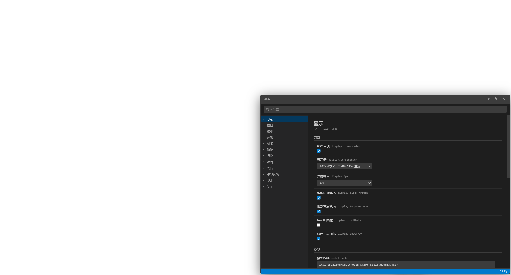
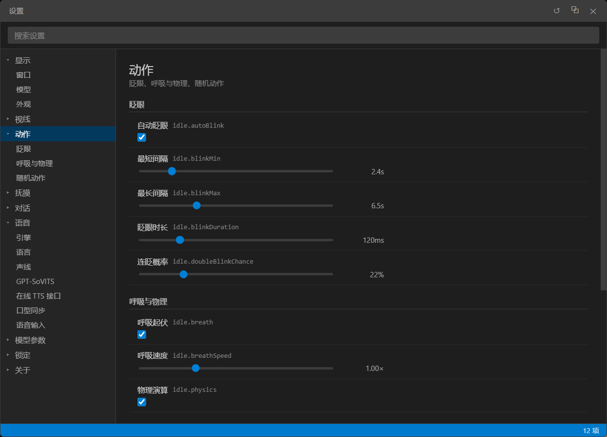
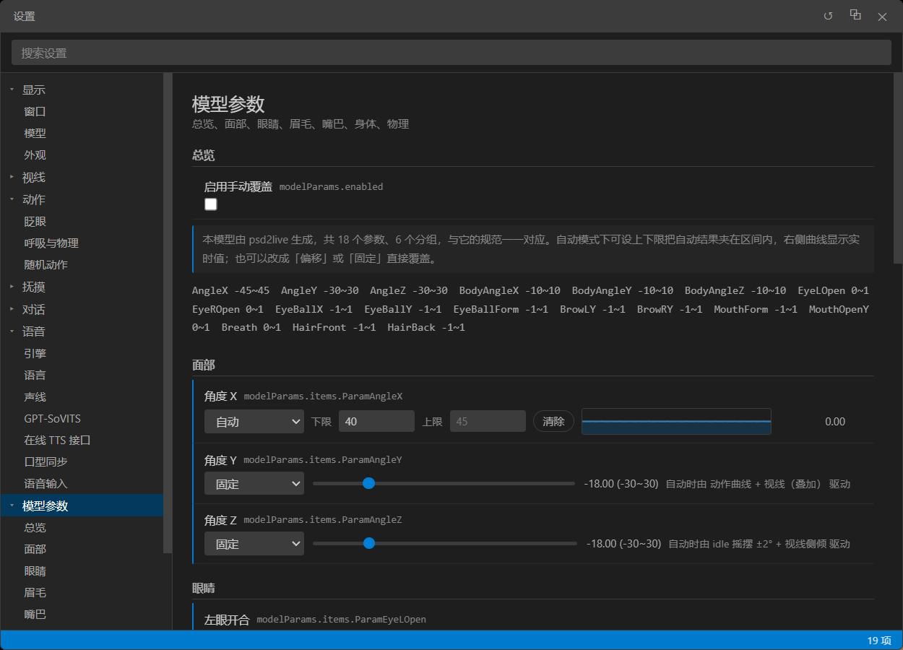

# Live2D desktop pet

A desktop pet that runs on the Windows desktop. It renders a **Live2D Cubism model** with Electron + PixiJS
(gaze follows the mouse, it can be petted on the head, expressions and motions switch with the mood), speaks
with **synthesized TTS voice** (including local GPT-SoVITS voice cloning), and talks to **any
OpenAI-compatible API**.

**The repository contains only the program itself** — models, personas, voices and chat backends must all be
supplied by you. They are all settings, not hard-coded:

| What you supply | Where to configure it |
| --- | --- |
| **Model** | Settings → Display → Model path: point it at any `model3.json`. The model must use Cubism standard parameter names |
| **Persona** | Settings → Chat → Persona: system prompt, name, greeting, petting lines |
| **Voice** | Settings → Voice: local GPT-SoVITS voice cloning, or any OpenAI-compatible online TTS API |
| **Chat backend** | Settings → Chat: any service compatible with `POST /chat/completions` |

> This repository contains **no** Live2D models, art assets or voice assets, and no content for any
> character — the first launch prompts you for a model path. Do not commit assets you have no right to
> distribute; see [NOTICE.md](NOTICE.md).

## Features

| Feature | Implementation | Measured in self-test |
| --- | --- | --- |
| **Gaze tracking** | Eyeballs `ParamEyeBallX/Y` + head `ParamAngleX/Y/Z` + body `ParamBodyAngleX/Y`, with distance falloff, natural drift and microsaccades; all amplitudes adjustable | Move the mouse from the far left of the screen to the far right: `ParamEyeBallX` −0.13 → +0.37 (Δ**0.50**) |
| **Chat** | Standalone chat panel, SSE streaming output, connects to any OpenAI-compatible API; custom persona and lines, with emotion tags and history memory | Streaming deltas and emotion tag parsing pass |
| **Petting** | Hold the left button to pet: **GPU pixel-level alpha hit detection** (hugs the real outline, not a bounding box); petting the head spawns hearts, narrows the eyes, speaks a line and plays a soft petting sound; while being petted the eyes stop but the **head still follows the mouse slightly**; **no affinity value, and the interface shows no HUD** | Real mouse events injected to hold and pet back and forth, emotion switched to `happy`; eye-narrowing / head-following / sound-toggle assertions pass one by one |
| **Voice** | Reading falls back automatically **between two engines** (local GPT-SoVITS voice cloning → online TTS API), switches timbre by language automatically, supports pitch shaping, and drives the mouth from the real waveform analyzed with Web Audio; input side microphone → Whisper-compatible API | Mouth `ParamMouthOpenY` peak **0.53~0.97**, language detection 8/8 |
| **Settings panel** | VS Code style: category tree + search + key name display + modified markers; 114 settings in total, parameters **can be locked** | Lock semantics, parameter bounds, toggle enforcement and petting settings assertions pass |

These numbers all come from the built-in offscreen self-test, which you can run yourself — see
[Development guide](docs/development.md).

| Settings panel | Motion | Model parameters |
| --- | --- | --- |
|  |  |  |

## Quick start

```bash
git clone https://github.com/P1r2y/L2dvpet.git
cd L2dvpet

npm install        # install dependencies the first time (Electron + PixiJS + Live2D library)
npm start          # build the frontend and launch the pet
```

On the first launch there is no model yet; the program prompts you to specify a `model3.json` in
**Settings → Display → Model path**. Any Live2D Cubism model will do (your own, or an official sample model).

> To only rebuild the frontend assets (without launching): `npm run build`
> To launch directly (skipping the build): `npm run app`

### Requirements

- Windows 10 / 11
- Node.js ≥ 18 (developed and verified on Node 24 + Electron 38)
- A GPU with WebGL 2 support (verified on RTX 3060 Ti + ANGLE/D3D11)

## Controls

| Action | Effect |
| --- | --- |
| **Hold the left button and move over the model** | **Pet** — petting the head spawns hearts, narrows the eyes (can be turned off), plays the petting sound and a random line |
| **Hold the right button and drag** (or `Alt` + left-drag) | **Move** the pet (the position is saved on release) |
| **Right-click** | Opens the menu: Chat / Voice input / Nod and shake / Voice toggle / Mouse passthrough / Settings / Hide / Quit |
| **Move the mouse over the model** | A quick-action bar slides out on the right (💬 chat, 🎤 speak, 🔊 voice, ⚙️ settings, 👁 hide) |
| `Esc` | Cancels the current pet or drag; press again to close panels |

In-app shortcuts (when focus is not in a text field): `C` chat, `S` settings, `M` microphone, `H` hide.

### Global shortcuts

| Shortcut | Effect |
| --- | --- |
| `Ctrl+Shift+H` | Show / hide the pet (when hidden, bring it back from the tray icon) |
| `Ctrl+Shift+C` | Open / close chat |
| `Ctrl+Shift+S` | Open / close settings |
| `Ctrl+Shift+Space` | Voice input (can be changed or cleared in Settings → Voice) |

> **Mouse passthrough**: the window uses "smart passthrough" by default — when the mouse is not over the
> model or a panel, clicks pass through to the desktop normally, so the pet never blocks you from using other
> applications. If you are worried something will go wrong, you can always quit from the tray menu.

## Documentation

This README covers only what you need to get started; the in-depth material is split into `docs/`.

| Document | Content |
| --- | --- |
| [Voice and timbre](docs/voice.md) | Reading engine choices, GPT-SoVITS integration, automatic timbre switching by language, pitch compensation |
| [Chat and settings](docs/chat-and-settings.md) | Chat API configuration, emotion tag protocol, settings panel and parameter locking |
| [FAQ](docs/faq.md) | Troubleshooting by symptom: no voice / GPT-SoVITS unreachable / wrong mouth shape ... |
| [Development guide](docs/development.md) | Code structure, non-obvious implementation points, offscreen self-test |
| [Optimization notes](docs/optimization-notes.md) | Not published yet (the file content is just a placeholder note) |

## Known limitations

- **You must supply the model yourself**: the program relies on Cubism standard parameter names (`ParamAngleX/Y/Z`,
  `ParamEyeBallX/Y`, `ParamMouthOpenY`, `ParamBodyAngleX/Y`, etc.) and the `Idle` / `Blink` motion groups. A
  model whose parameter names do not match shows up as "gaze does not move / no blinking"; use
  `scripts/tools/inspect-model-params.cjs` to check.
- **Windows only**: window mouse passthrough relies on Electron's implementation on Windows.
- **This repository contains no third-party models, art or voice assets**, see [NOTICE.md](NOTICE.md).

## License

**The source code** is under the [MIT license](LICENSE). The repository contains no third-party assets, so
there is no layered-licensing complexity; any models or assets you add yourself remain with their respective
rights holders and are not covered by this repository's MIT license — see [NOTICE.md](NOTICE.md).

- Live2D rendering: [pixi-live2d-display](https://github.com/guansss/pixi-live2d-display) + [PixiJS 6](https://pixijs.com/)
- Live2D Cubism Core © Live2D Inc., under the [Live2D Proprietary Software License Agreement](https://www.live2d.com/eula/live2d-proprietary-software-license-agreement_en.html) (redistributable code)
- Before using any Live2D model, confirm that model's license terms first.
